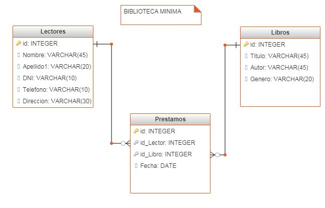

### Table of Contents ###
1. [**HackerRankChallenges**](https://github.com/LanaSweet/HackerRankChallenges)
HackerRank Challenges solved and passed all the test cases
2. [**gitUdemy**](https://github.com/LanaSweet/gitUdemy)
Practicing using gitHub, creating Issue and Feature templates, creating branches locally and in the gitHub, updating merging, solving merge conflicts.
3. [**html5-boilerplate**](https://github.com/LanaSweet/html5-boilerplate)
Forked repository to practice collaboration on a project with many collaborators.
4. [**TextAnalytics**](https://github.com/LanaSweet/TextAnalytics)
Forked project for practice to collaborate on the project from the local and from the Google Colab using Google Drive for modifying PythonNoteBook file.
5. [**Biblioteca**](https://github.com/LanaSweet/Biblioteca)
Spring Project developed with Spring Tool Suite 4.8.0.RELEASE of a library service for book lending. 
It consists of 3 tables for viewving the books available, readers registered and actual lendings. 

